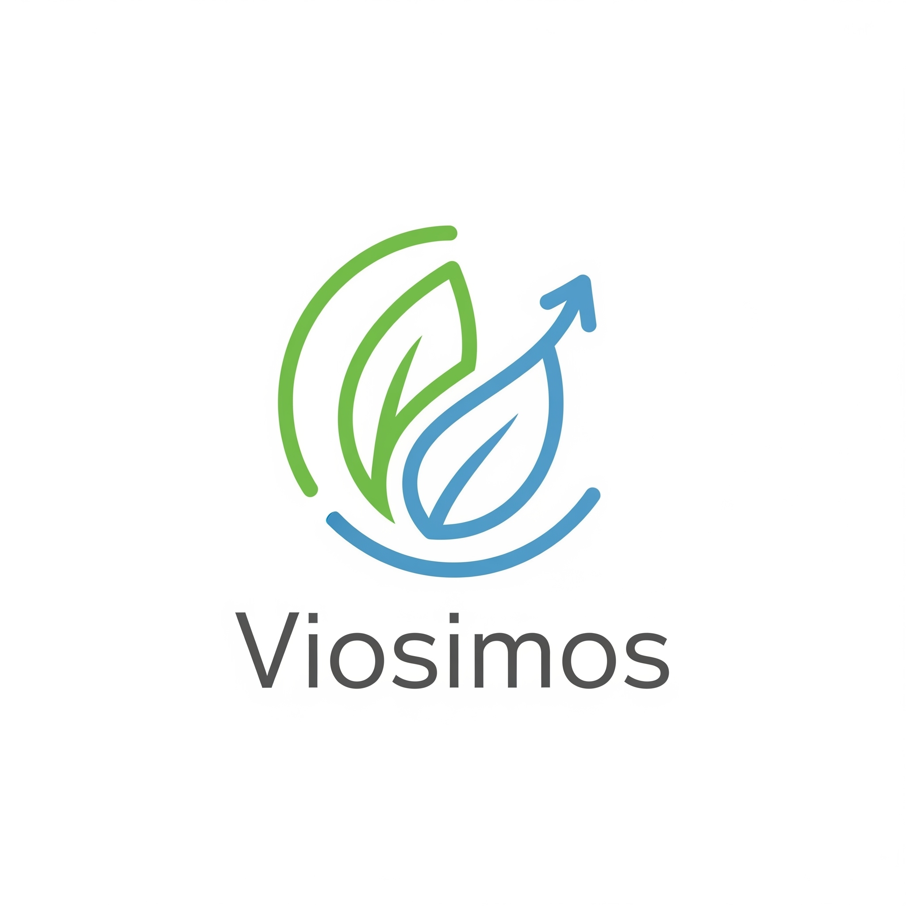
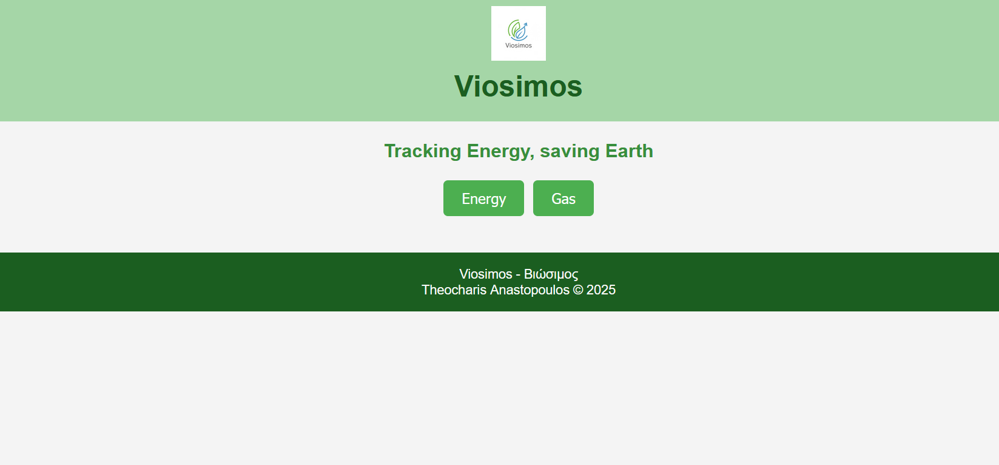
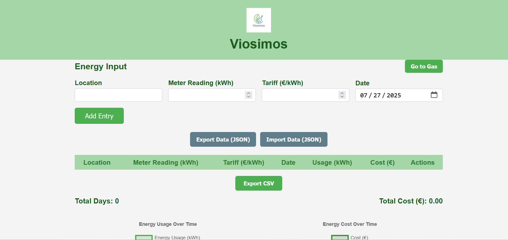
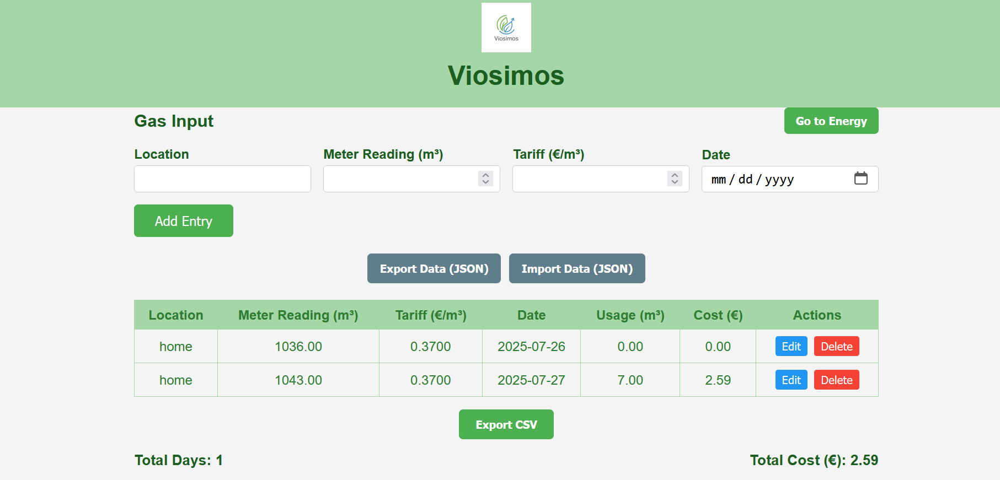
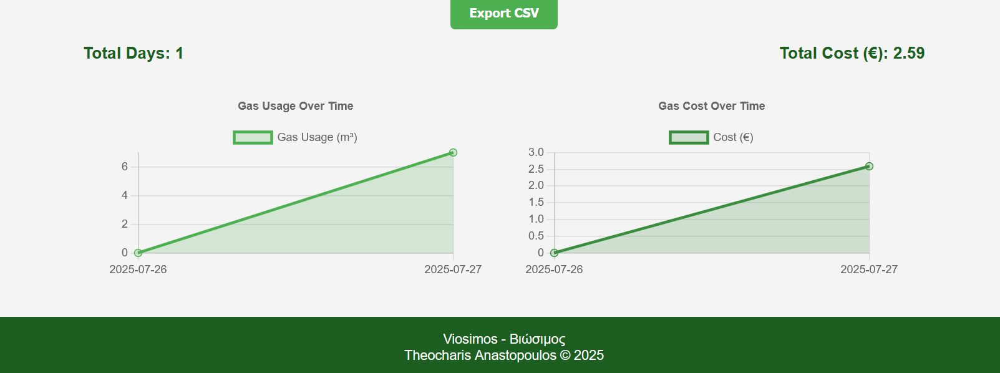

# Viosimos - Βιώσιμος (Sustainable)

<p align="center">
  
</p>

**Viosimos** (Βιώσιμος in Greek, meaning *Sustainable*) is a simple client-side web app to track your energy (electricity) and gas consumption. It helps you input meter readings, calculate usage and costs, visualize trends, and manage data locally or via export/import.

---

## Features

- Track electricity and gas meter readings, tariffs, and dates
- Auto calculate usage and costs between readings
- Interactive charts using Chart.js
- Data saved in browser local storage (LocalForage)
- Export/Import CSV and JSON backups
- Responsive design for all devices
- Clean, easy-to-use interface

---

## Getting Started

1. Clone the repo:

    ```bash
    git clone https://github.com/theo79/viosimos.git
    cd viosimos
    ```

2. Open `index.html` in your favorite browser (Chrome, Firefox, Edge).

3. Start entering your meter data and explore the features!

---

## Project Structure

index.html - Main page
energy.html - Electricity tracking
gas.html - Gas tracking
style.css - Stylesheet
viosimos.png - Logo image
license.txt - License (CC BY-NC 4.0)
README.md - This file


---

## Technologies Used

- HTML5  
- CSS3  
- JavaScript (ES6+)  
- [Chart.js](https://www.chartjs.org/)  
- [LocalForage](https://localforage.github.io/localForage/)  

---

## Future Improvements

- User accounts and cloud sync  
- Monthly/Annual reports  
- Cost projections  
- Meter reading reminders  
- Multi-currency support  
- Light/Dark themes  

---

## License

This project is licensed under **Creative Commons Attribution-NonCommercial 4.0 International (CC BY-NC 4.0)**. See [license.txt](./license.txt) for details.

---

## Author

Theocharis Anastopoulos © 2025

---

## Screenshots

<p align="center">
  
  
  
  
</p>

---

Thank you for using **Viosimos** — helping you be sustainable one meter reading at a time!


